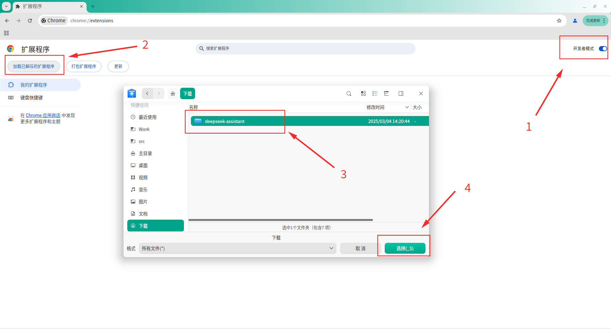
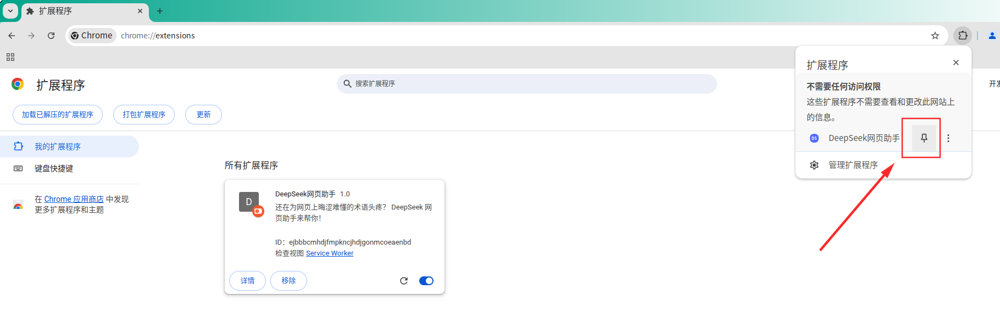
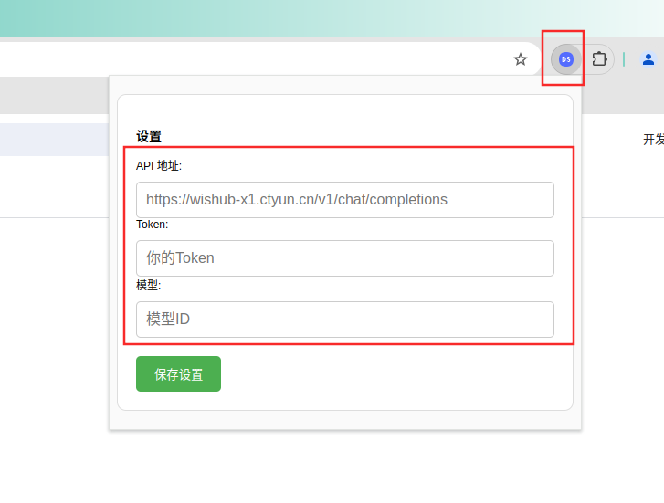

# 使用教程

## 一、安装步骤

### 1.1 源码安装

1. 下载项目代码
2. 打开 Chrome 浏览器，进入 `chrome://extensions/`
3. 启用右上角的"开发者模式"
4. 点击"加载已解压的扩展程序"
5. 选择本项目目录
6. 扩展程序将出现在扩展列表中

安装过程如下图

安装完成之后，固定到顶部，如下图

点击扩展图标，进入设置页面

## 二、使用说明

- **设置API**：在配置页面填写上 `completions` 接口地址，相关 DeekSeek 云端接口整理如下

|      厂商      |                    模型ID                     |               completions接口地址                |       备注        |
| -------------- | --------------------------------------------- | ------------------------------------------------ | ----------------- |
| DeepSeek官方   | 常用对话模型: `deepseek-chat`                 | <https://api.deepseek.com/v1/chat/completions>   | 需自行开通API功能 |
| 天翼云DeepSeek | v3-升腾版: `9dc913a037774fc0b248376905c85da5` | <https://wishub-x1.ctyun.cn/v1/chat/completions> | 需自行开通API功能 |

以上只是简单列举，理论上兼容所有 ”OpenAI兼容接口“，可以选择更多的云产商。只要开通对于的 API 服务，并选择一个可用的 `模型ID` 与 `token` 即可。

- **AI助手**：选择网页上的文本内容后，点击鼠标右键扩展菜单 ”DeepSeek Assistant“ 或者 ”DeepSeek网页助手“，再选择功能按钮进行操作

## 三、常见问题

Q: 为什么扩展没有生效？
A: 请确保：

- 已正确安装扩展
- 在目标网站上刷新页面
- 扩展功能适用于当前网站

Q: 如何更新扩展？
A: 在 `chrome://extensions/` 页面点击"重新加载"按钮
